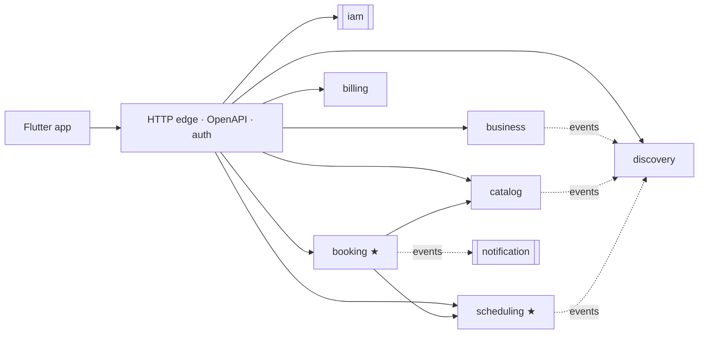

# barbershop-backend

Multi-tenant **barbershop booking SaaS** backend in **Go** — built with Domain-Driven Design as a
modular monolith, PostgreSQL + PostGIS for map search, and phone-OTP authentication.
The mobile app (Flutter, Arabic-first) will consume this API.

> **Status: M0 — Planning.** The architecture, domain model and roadmap are in [`docs/`](docs/PLAN.md).
> Implementation starts with M1 (walking skeleton).

## What it does

- **Barbershops (tenants)** register, get verified (Commercial Registration), and manage multiple
  **branches** — each with its own map location, opening hours, services, prices and **barbers**.
- **Barbers** have individual schedules (split shifts, shifts past midnight, time off).
- **Customers** find branches **nearby on the map** or **by city**, choose services, a specific barber
  or **"any available barber"**, and book a slot. Pay at the shop.
- **Business mode** in the same app: today's timeline per barber, bookings, services, team, schedules.
- **Subscription plans** per business with enforced limits.

## Architecture

- **Modular monolith**: one binary, one module per bounded context, strict boundaries checked in CI.
- **Hexagonal layers** per module: pure `domain` → `app` use cases → `adapters` (HTTP, Postgres, providers).
- **Double booking is impossible by construction**: a Postgres exclusion constraint on each barber's time ranges.
- **Transactional outbox** (River) for reliable domain events and scheduled reminders.

## Tech stack

Go · net/http + chi · PostgreSQL + PostGIS · pgx + sqlc · goose · River · OpenAPI (oapi-codegen) ·
JWT (EdDSA) · log/slog · testcontainers-go · golangci-lint · Docker Compose · GitHub Actions

## Documentation

| | |
|---|---|
| [Master plan & roadmap](docs/PLAN.md) | decisions, scope, milestones, workflow |
| [Architecture overview](docs/architecture/overview.md) | layers, folder layout, Go conventions |
| [Domain model](docs/architecture/domain-model.md) | bounded contexts, aggregates, invariants, availability algorithm |
| [Persistence](docs/architecture/persistence.md) | tenancy, schemas, constraints, time & money |
| [API overview](docs/api/overview.md) | conventions and v1 endpoints |
| [Design system](docs/design/design-system.md) | mobile design direction (IBM Plex, green · navy · white, RTL) |
| [ADRs](docs/adr/) | why each major decision was made |
| [Node → Go guide](docs/learning/node-to-go.md) | the mindset shift, written along the way |

## Roadmap

- [x] M0 — Planning: domain model, architecture, ADRs, design direction
- [ ] M1 — Walking skeleton: server, config, Postgres/PostGIS, migrations, CI
- [ ] M2 — Shared kernel + IAM: phone OTP, JWT, refresh rotation
- [ ] M3 — Business onboarding: verification, branches, staff, plans
- [ ] M4 — Catalog + scheduling: services, opening hours, barber schedules
- [ ] M5 — Booking core: availability engine, booking lifecycle
- [ ] M6 — Discovery: map / city / text search
- [ ] M7 — Notifications: push, SMS, reminders
- [ ] M8 — Hardening + Flutter hand-off

## About

Built by [Abdulkhaliq](https://github.com/Abdulkhaliq-84) while moving from Node.js to Go — with an
AI pair programmer used as a *guided scaffolder*: it builds the first instance of each pattern, I build
the next one, and every PR explains the Go idioms it introduces.
