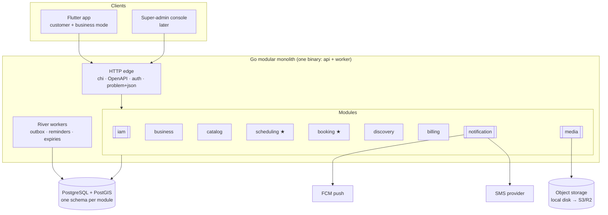

# Master Plan — Barbershop Booking SaaS (Go backend)

> Status: **M0 — Planning** · Nothing is implemented yet. This document is the single entry point;
> everything else in `docs/` goes deeper on one topic.

## 1. Product in one paragraph

A multi-tenant SaaS for barbershops in Saudi Arabia / GCC. A **business** (the tenant) registers,
gets verified by the platform (Commercial Registration), and manages one or more **branches** — each
with its own location on the map, opening hours, **services** and **barbers**, and every barber has
their own working schedule. **Customers** discover branches on a map or by city, pick services, pick
a barber (or "any available barber") and book a time slot. Payment happens at the shop in v1. The
platform earns money through **subscription plans** per business.

## 2. Decisions locked in the planning session

| Area | Decision | Details |
|---|---|---|
| Market | Saudi / GCC | Arabic-first (RTL) + English, SAR, `Asia/Riyadh`, local providers |
| Tenancy | Business → Branches → Barbers | One owner account, many branches, per-barber schedules — [ADR-0004](adr/0004-multi-tenancy-shared-schema.md) |
| Booking modes (v1) | Specific barber · "Any available barber" · Multi-service | Walk-in live queue deferred |
| Customer payment | Pay at the shop | Payments context designed, not built — [ADR-0010](adr/0010-pay-at-shop-first.md) |
| Revenue | Subscription plans per business | Plans + limits enforced in v1, online collection later |
| Onboarding | Manual admin approval | CR number + document + photos → Pending review → Approved / Rejected |
| Shop management | Same Flutter app, role-based "Business mode" | Small web super-admin console later |
| Notifications | Push (FCM) + SMS (OTP) in v1 | WhatsApp / e-mail behind the same port later |
| Architecture | DDD **modular monolith** | [ADR-0002](adr/0002-modular-monolith.md) |
| Go stack | Idiomatic: `net/http` + chi, pgx + sqlc, goose, slog | No ORM — [ADR-0003](adr/0003-go-stack.md) |
| Database | PostgreSQL + PostGIS | Map / radius search — [ADR-0005](adr/0005-postgres-postgis.md) |
| API | OpenAPI-first REST, `/v1` | Dart client generated for Flutter — [ADR-0006](adr/0006-openapi-first.md) |
| Auth | Own auth: phone OTP + JWT + rotating refresh tokens | [ADR-0007](adr/0007-auth-phone-otp-jwt.md) |
| Hosting | **localhost** (Docker Compose) for now | 12-factor config → any host later (Render / Fly / AWS me-central) |
| Repo | `barbershop-backend`, **public**, backend only | Flutter app in its own repo later |
| Design | Figma, **in parallel** with backend | IBM Plex Sans Arabic + IBM Plex Sans; green · navy · white — [design system](design/design-system.md) |
| Workflow | **Guided AI scaffolding** | I scaffold the first instance of each pattern, you write the next one — see §6 |

## 3. Architecture at a glance

★ = core domain (where the product wins or loses): **availability and booking**.

Deep dives:

- [Architecture overview](architecture/overview.md) — layers, folder layout, module rules, Go conventions, tech stack
- [Domain model](architecture/domain-model.md) — bounded contexts, aggregates, invariants, events, availability algorithm
- [Persistence](architecture/persistence.md) — tenancy, schemas, key tables and constraints, time and money
- [API overview](api/overview.md) — conventions and the v1 endpoint inventory
- [Design system](design/design-system.md) — brand, tokens, RTL, screen inventory, Figma plan
- [Node → Go mindset guide](learning/node-to-go.md)
- [Architecture Decision Records](adr/)

## 4. Scope of v1 (MVP)

**In**

- Phone OTP login, profiles, roles (customer, owner, manager, barber, platform admin)
- Business registration → CR verification → admin approval
- Branches with map location, city/district, photos, booking policy
- Services per branch (duration, price), which barbers perform which service (optional price override)
- Branch opening hours and closures; barber weekly schedules (split shifts, **shifts past midnight**), time off
- Availability: specific barber, any barber, multi-service; slot grid per branch policy
- Booking lifecycle: book, confirm/reject (if the shop requires it), cancel (policy window), complete, no-show
- Staff-created bookings (walk-ins / phone bookings) so the barber's calendar is always the truth
- Discovery: nearby (radius), by city, text search (Arabic-normalised), filters, open-now
- Subscription plans with entitlements (max branches / barbers), trial, admin plan assignment
- Push notifications (booking events, reminders), SMS for OTP
- Business-mode dashboard data: today's bookings per barber, simple KPIs

**Out (later, designed for)**

Reviews & ratings · online deposits / prepayment (Moyasar / Tap) · subscription payment collection + ZATCA
e-invoicing · WhatsApp / e-mail · rescheduling · walk-in live queue · customer no-show reliability score
and blocking · loyalty / offers · favourites · owner analytics · super-admin web console · freelance barbers.

## 5. Roadmap

Each milestone ships as a series of **small PRs** (one concept per PR). Every PR description carries a
"Go concepts introduced (Node → Go)" section and a "Your turn" exercise.

| # | Milestone | What ships | Go concepts you learn | Your exercise |
|---|---|---|---|---|
| M0 | **Planning** (this PR) | Plan, ADRs, design direction, AI guardrails (`CLAUDE.md`) | — | Review and challenge the plan |
| M1 | **Walking skeleton** | `go.mod`, `cmd/api`, config, slog, chi, `/healthz` `/readyz`, graceful shutdown, Docker Compose (PostGIS), goose, sqlc, Makefile, golangci-lint (+ module-boundary rules), GitHub Actions CI, air | packages & modules, `main` wiring, `context`, `http.Server`, errors as values | Add `GET /version` using `debug.ReadBuildInfo` |
| M2 | **Shared kernel + IAM** | Value objects (PhoneNumber, Money, LocalizedText, GeoPoint), OTP request/verify (console SMS adapter), Ed25519 JWT, refresh rotation, auth middleware, `GET /me` | constructors & invariants, unexported fields, consumer-side interfaces, sqlc + pgx transactions, table-driven tests, testcontainers | Implement `PATCH /me` |
| M3 | **Business onboarding** | Register business, CR upload (media), submit/approve/reject, branches with location, staff invitations + roles, authorization policy, plans & entitlements (billing), River outbox | state machines, domain events, transactional outbox, object-level authorization | Implement suspend / reactivate business |
| M4 | **Catalog + Scheduling** | Service categories, services, barber offerings, opening hours, closures, barber schedules (overnight), time off | modelling time (`time.Location`, wall-clock vs instant), validation-heavy value objects | Implement branch closures end-to-end |
| M5 | **Booking core ★** | Availability calculator (pure), slots query (specific / any / multi-service), book with `Idempotency-Key`, exclusion constraint → 409, cancel policy, shop actions, staff bookings, pending-expiry job | pure domain services, **fuzz tests**, benchmarks, `errgroup`, race-safe concurrency tests | "My appointments" with cursor pagination |
| M6 | **Discovery** | Read-model projections from events, PostGIS nearby, city search, Arabic-normalised trigram search, open-now, branch public profile | CQRS read models, idempotent handlers, geo queries, `EXPLAIN ANALYZE` | Add "sort by starting price" |
| M7 | **Notifications** | Device tokens, FCM adapter, ar/en templates, reminders as scheduled River jobs, real SMS adapter | background workers, retries/backoff, external API adapters, HTTP client timeouts | Add the 24 h reminder |
| M8 | **Hardening + Flutter hand-off** | RLS as defence in depth, rate limiting, OpenTelemetry, govulncheck, k6 load tests, seed data (demo Riyadh shops), published OpenAPI + generated Dart client, Postman collection | profiling (`pprof`), observability, security review | Write a k6 scenario for the booking flow |

### Design track (in parallel, in Figma)

| # | Deliverable | Feeds |
|---|---|---|
| D1 | Foundations: tokens (colour, IBM Plex type scale, spacing, radii, elevation), RTL-first core components | Flutter `ThemeData` |
| D2 | Customer flows: language → phone + OTP → map/list home → branch page → booking wizard → my bookings | M2, M5, M6 API shapes |
| D3 | Business mode: onboarding wizard + pending review, **dashboard** (today, per-barber timeline, KPIs), bookings, services, staff & schedules, settings, plan | M3, M4, M5 API shapes |
| D4 | Hand-off: tokens → Flutter theme, component specs, API gaps back into `openapi.yaml` | Flutter repo |

Screens drive the contract: before an endpoint is built, the screen that uses it should exist (at
least as a wireframe), so the API returns exactly what the screen needs — no more, no less.

## 6. How we work: guided AI scaffolding

1. **Plan the slice** — pick the next roadmap row, agree on the endpoints in `api/openapi.yaml` first.
2. **I scaffold the first instance of a pattern** (e.g. the first aggregate + repository + handler in
   IAM) as a small PR with Node → Go explanations of every new idiom.
3. **You review and ask** — questions in PR comments; nothing merges until you understand it.
4. **You write the next instance yourself** (the PR's "Your turn" exercise), open a PR, and I review it
   like a senior Go reviewer would (idioms, errors, tests, boundaries).
5. **Guardrails stay on** — `CLAUDE.md` holds the rules every AI session must follow in this repo;
   CI (lint + tests + boundary checks) catches what reviews miss.

## 7. Risks and how the design handles them

| Risk | Mitigation |
|---|---|
| Double booking under concurrency | Postgres `EXCLUDE` constraint per barber time range — [ADR-0008](adr/0008-double-booking-exclusion-constraint.md) |
| Tenant data leaking between businesses (BOLA) | Every business-mode route is tenant-scoped by path + membership check in the application layer; repositories require `BusinessID`; RLS added in M8 |
| No-shows (customers don't prepay) | Cancellation window, max active bookings per customer, shop-side no-show marking; reliability score later |
| Time bugs (3-hour offsets, shifts after midnight) | Instants stored UTC, schedules as branch-local wall-clock, `Clock` interface, overnight-shift tests |
| Mobile retries creating duplicate bookings | `Idempotency-Key` on creates |
| Schema-per-tenant migration drift | Avoided by design: shared schema with `business_id` — [ADR-0004](adr/0004-multi-tenancy-shared-schema.md) |
| Learning curve slowing delivery | One pattern per PR, exercises, strict lint catching non-idiomatic code early |

## 8. Open questions (to settle before the milestone that needs them)

- Final brand name and colour variant (green · navy · white **vs** green · white) — settle in D1
  (own "modern barbershop" style, no external reference — see the [design system](design/design-system.md)).
- SMS provider for OTP (Unifonic / Authentica / Taqnyat) — M7; console adapter until then.
- Default booking policy values (lead time, horizon, cancellation window) — M5, with a real shop owner if possible.
- Hosting and data residency (in-Kingdom hosting for personal data under PDPL) — before first real users.
