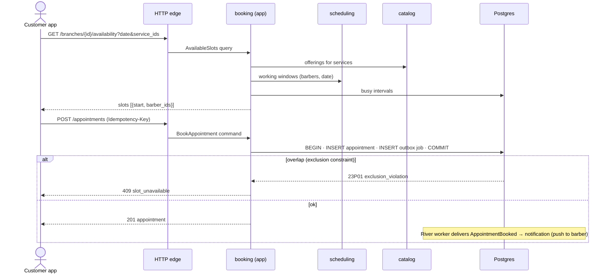

# API Overview (v1)

The contract lives in `api/openapi.yaml` (added in M1/M2) and is the **source of truth**: Go server
interfaces are generated from it (oapi-codegen strict server) and so is the Flutter Dart client.
Change the spec first, then the code ([ADR-0006](../adr/0006-openapi-first.md)).

## 1. Conventions

| Topic | Convention |
|---|---|
| Base path | `/v1` |
| Format | JSON, `snake_case` fields |
| Auth | `Authorization: Bearer <access JWT>` (15 min); refresh via `/v1/auth/refresh` |
| Language | `Accept-Language: ar` (default) or `en` → localised names, messages, errors |
| Tenant scope | Business-mode routes: `/v1/businesses/{business_id}/…` — membership checked on every call |
| Timestamps | RFC 3339 in UTC (`2026-10-01T13:30:00Z`); branch-local dates as `YYYY-MM-DD` + branch `timezone` |
| Money | `{"amount": 6000, "currency": "SAR"}` — amount in **halalas** (60.00 SAR) |
| Localised text | Customer endpoints return the resolved string; business-mode edit endpoints use `{"ar": "…", "en": "…"}` |
| Pagination | Cursor: `?limit=20&cursor=…` → `{"data": [...], "next_cursor": "…"}` |
| Errors | RFC 9457 `application/problem+json` with a stable `code` (see below) |
| Idempotency | `Idempotency-Key: <uuid>` required on creating bookings, recommended on other creates |
| Concurrency | Editable resources carry `version`; send `If-Match` to avoid lost updates between two managers |
| Rate limits | OTP: per phone and per IP; search: per IP — `429` with `Retry-After` |

Error example:

```json
{
  "type": "https://barbershop.app/problems/slot-unavailable",
  "title": "الموعد لم يعد متاحًا",
  "status": 409,
  "code": "slot_unavailable",
  "detail": "اختر وقتًا آخر",
  "request_id": "01J9…"
}
```

Stable error codes (grows per milestone): `validation_failed`, `unauthorized`, `forbidden`,
`not_found`, `conflict`, `rate_limited`, `internal`, `otp_invalid`, `otp_expired`, `otp_too_many_attempts`,
`otp_cooldown`, `user_blocked`, `refresh_token_reused`, `business_not_active`, `plan_limit_reached`, `slot_unavailable`,
`outside_booking_window`, `outside_cancellation_window`, `too_many_active_bookings`,
`invalid_state_transition`.

## 2. Endpoint inventory

### Auth & profile (`iam`) — M2

| Method | Path | Who |
|---|---|---|
| POST | `/v1/auth/otp/request` | public |
| POST | `/v1/auth/otp/verify` → access + refresh tokens | public |
| POST | `/v1/auth/refresh` | public (refresh token) |
| POST | `/v1/auth/logout` | user |
| GET / PATCH | `/v1/me` | user |
| GET | `/v1/me/memberships` → businesses & roles (drives "Business mode" switch) | user |
| POST / DELETE | `/v1/me/devices` (FCM token) | user — M7 |

**Phone OTP login (M2.2).** Status: request + verify are live; verify returns `{user, is_new_user}`
and gains the access/refresh tokens in M2.3.

| Rule | Value | Error when broken |
|---|---|---|
| Phone | Saudi mobile, any common spelling (`05…`, `+9665…`, `009665…`, spaces, Arabic digits) | 422 `validation_failed` |
| Code | 6 digits, Western or Arabic-Indic, single use, stored only as an HMAC-SHA256 hash | 401 `otp_invalid` |
| Lifetime | 5 minutes | 401 `otp_expired` |
| Wrong guesses | 5 per code, then the code is dead — request a new one | 429 `otp_too_many_attempts` |
| Resend cooldown | 60 s between codes for one phone | 429 `otp_cooldown` + `Retry-After` |
| Hourly cap | 5 codes per phone per hour | 429 `rate_limited` + `Retry-After` |
| Blocked account | platform admin blocked the user | 403 `user_blocked` |

The per-IP hourly cap from [ADR-0007](../adr/0007-auth-phone-otp-jwt.md) lands with the first real SMS
provider (M7); until then `SMS_PROVIDER=console` is the only provider and is refused in production.
An unknown phone and an already-used code get the same `otp_invalid` as a wrong code; the client
shows one message ("the code is wrong or no longer valid") and offers "send a new code".

### Discovery (public) — M6

| Method | Path |
|---|---|
| GET | `/v1/cities` |
| GET | `/v1/branches/search?lat=&lng=&radius_km=&city=&q=&category=&open_now=&sort=distance\|price&cursor=` |
| GET | `/v1/branches/{branch_id}` — public profile: photos, hours, services, barbers |
| GET | `/v1/categories` |

### Customer booking — M5

| Method | Path |
|---|---|
| GET | `/v1/branches/{branch_id}/availability?date=&service_ids=&barber_id=` (omit `barber_id` = any barber) |
| POST | `/v1/appointments` (Idempotency-Key) |
| GET | `/v1/me/appointments?status=upcoming\|past&cursor=` |
| GET | `/v1/me/appointments/{appointment_id}` |
| POST | `/v1/me/appointments/{appointment_id}/cancel` |

### Business mode — M3 / M4 / M5

| Method | Path | Min role |
|---|---|---|
| POST | `/v1/businesses` (register → Draft) | user |
| GET / PATCH | `/v1/businesses/{business_id}` | owner |
| POST | `/v1/businesses/{business_id}/verification/documents` (CR upload) | owner |
| POST | `/v1/businesses/{business_id}/verification/submit` | owner |
| GET / POST | `/v1/businesses/{business_id}/branches` | owner |
| GET / PATCH | `/v1/businesses/{business_id}/branches/{branch_id}` (profile, location, policy) | manager |
| POST | `…/branches/{branch_id}/publish` · `…/unpublish` | owner |
| PUT | `…/branches/{branch_id}/opening-hours` | manager |
| GET / POST / DELETE | `…/branches/{branch_id}/closures` | manager |
| GET / POST / PATCH | `…/branches/{branch_id}/services` | manager |
| GET / POST | `/v1/businesses/{business_id}/staff` · `/staff/invitations` | owner |
| POST | `/v1/invitations/{token}/accept` | invited user |
| GET / PUT | `/v1/businesses/{business_id}/staff/{staff_id}/schedule` | manager / the barber |
| GET / POST / DELETE | `/v1/businesses/{business_id}/staff/{staff_id}/time-off` | manager / the barber |
| GET | `…/branches/{branch_id}/day?date=` — per-barber timeline + KPIs (dashboard) | barber (own) / manager |
| POST | `…/branches/{branch_id}/appointments` — staff booking / walk-in | barber |
| POST | `/v1/businesses/{business_id}/appointments/{appointment_id}/{confirm\|reject\|complete\|no-show\|cancel}` | barber (own) / manager |
| GET | `/v1/businesses/{business_id}/subscription` | owner |

### Platform admin — M3

| Method | Path |
|---|---|
| GET | `/v1/admin/businesses?status=pending_review&cursor=` |
| GET | `/v1/admin/businesses/{business_id}` (incl. signed URLs to CR documents) |
| POST | `/v1/admin/businesses/{business_id}/{approve\|reject\|suspend\|reactivate}` |
| PUT | `/v1/admin/businesses/{business_id}/subscription` (assign plan) |
| CRUD | `/v1/admin/categories`, `/v1/admin/plans`, `/v1/admin/cities` |

### Operations

`GET /healthz` (liveness) · `GET /readyz` (DB reachable) · `GET /version` (build info).

## 3. Example: booking flow


