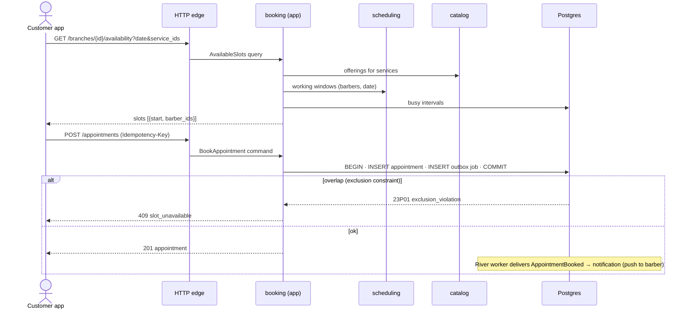

# API Overview (v1)

The contract lives in `api/openapi.yaml` (added in M1/M2) and is the **source of truth**: Go server
interfaces are generated from it (oapi-codegen strict server) and so is the Flutter Dart client.
Change the spec first, then the code ([ADR-0006](../adr/0006-openapi-first.md)).

## 1. Conventions

| Topic | Convention |
|---|---|
| Base path | `/v1` |
| Format | JSON, `snake_case` fields |
| Auth | `Authorization: Bearer <access JWT>` (15 min); refresh via `/v1/auth/refresh` |
| Language | `Accept-Language: ar` (default) or `en` → localised names, messages, errors |
| Tenant scope | Business-mode routes: `/v1/businesses/{business_id}/…` — membership checked on every call |
| Timestamps | RFC 3339 in UTC (`2026-10-01T13:30:00Z`); branch-local dates as `YYYY-MM-DD` + branch `timezone` |
| Money | `{"amount": 6000, "currency": "SAR"}` — amount in **halalas** (60.00 SAR) |
| Localised text | Customer endpoints return the resolved string; business-mode edit endpoints use `{"ar": "…", "en": "…"}` |
| Pagination | Cursor: `?limit=20&cursor=…` → `{"data": [...], "next_cursor": "…"}` |
| Errors | RFC 9457 `application/problem+json` with a stable `code` (see below) |
| Idempotency | `Idempotency-Key: <uuid>` required on creating bookings, recommended on other creates |
| Concurrency | Editable resources carry `version`; send `If-Match` to avoid lost updates between two managers |
| Rate limits | OTP: per phone and per IP; search: per IP — `429` with `Retry-After` |

Error example:

```json
{
  "type": "https://barbershop.app/problems/slot-unavailable",
  "title": "الموعد لم يعد متاحًا",
  "status": 409,
  "code": "slot_unavailable",
  "detail": "اختر وقتًا آخر",
  "request_id": "01J9…"
}
```

Stable error codes (grows per milestone): `validation_failed`, `unauthorized`, `forbidden`,
`not_found`, `conflict`, `rate_limited`, `internal`, `otp_invalid`, `otp_expired`, `otp_too_many_attempts`,
`otp_cooldown`, `user_blocked`, `refresh_token_reused`, `business_already_registered`, `business_not_active`, `plan_limit_reached`, `slot_unavailable`,
`outside_booking_window`, `outside_cancellation_window`, `too_many_active_bookings`,
`invalid_state_transition`, `version_conflict` (412: the resource changed since you read it),
`unsupported_media_type` (415), `payload_too_large` (413), `document_limit_reached`, `download_link_invalid` (403),
`cr_document_required`, `branch_required`, `cr_number_taken`.

## 2. Endpoint inventory

### Auth & profile (`iam`) — M2

| Method | Path | Who |
|---|---|---|
| POST | `/v1/auth/otp/request` | public |
| POST | `/v1/auth/otp/verify` → user + access & refresh tokens | public |
| POST | `/v1/auth/refresh` | public (refresh token) |
| POST | `/v1/auth/logout` | user |
| GET / PATCH | `/v1/me` | user (PATCH: owner exercise) |
| GET | `/v1/me/memberships` → businesses & roles (drives "Business mode" switch) — live (M3.1) | user |
| POST / DELETE | `/v1/me/devices` (FCM token) | user — M7 |

**Phone OTP login (M2.2).** Request and verify are live; verify returns `{user, is_new_user, tokens}`.

| Rule | Value | Error when broken |
|---|---|---|
| Phone | Saudi mobile, any common spelling (`05…`, `+9665…`, `009665…`, spaces, Arabic digits) | 422 `validation_failed` |
| Code | 6 digits, Western or Arabic-Indic, single use, stored only as an HMAC-SHA256 hash | 401 `otp_invalid` |
| Lifetime | 5 minutes | 401 `otp_expired` |
| Wrong guesses | 5 per code, then the code is dead — request a new one | 429 `otp_too_many_attempts` |
| Resend cooldown | 60 s between codes for one phone | 429 `otp_cooldown` + `Retry-After` |
| Hourly cap | 5 codes per phone per hour | 429 `rate_limited` + `Retry-After` |
| Blocked account | platform admin blocked the user | 403 `user_blocked` |

The per-IP hourly cap from [ADR-0007](../adr/0007-auth-phone-otp-jwt.md) lands with the first real SMS
provider (M7); until then `SMS_PROVIDER=console` is the only provider and is refused in production.
An unknown phone and an already-used code get the same `otp_invalid` as a wrong code; the client
shows one message ("the code is wrong or no longer valid") and offers "send a new code".

**Tokens and sessions (M2.3, [ADR-0014](../adr/0014-sessions-and-access-tokens.md)).** Every operation
needs `Authorization: Bearer <access_token>` unless the spec marks it `security: []`.

| Token | Lifetime | Rules | Error |
|---|---|---|---|
| Access (JWT, Ed25519) | 15 min | Checked without a database; still valid until expiry after logout | 401 `unauthorized` + `WWW-Authenticate` |
| Refresh (`rt_…`, opaque) | 30 days if unused | Single use: every refresh returns a new one | 401 `refresh_token_invalid` |
| Refresh, used twice | — | Treated as stolen: the whole session ends, sign in again | 401 `refresh_token_reused` |

Client flow (Flutter):
1. Keep both tokens in secure storage.
2. On `401 unauthorized`, refresh **once**, sharing that one refresh call between all waiting requests, then retry.
3. If refresh fails with `refresh_token_*`, go to the login screen.
4. `POST /v1/auth/logout` ends the session; drop both tokens locally.

### Discovery (public) — M6

| Method | Path |
|---|---|
| GET | `/v1/cities` |
| GET | `/v1/branches/search?lat=&lng=&radius_km=&city=&q=&category=&open_now=&sort=distance\|price&cursor=` |
| GET | `/v1/branches/{branch_id}` — public profile: photos, hours, services, barbers |
| GET | `/v1/categories` |

### Customer booking — M5

| Method | Path |
|---|---|
| GET | `/v1/branches/{branch_id}/availability?date=&service_ids=&barber_id=` (omit `barber_id` = any barber) |
| POST | `/v1/appointments` (Idempotency-Key) |
| GET | `/v1/me/appointments?status=upcoming\|past&cursor=` |
| GET | `/v1/me/appointments/{appointment_id}` |
| POST | `/v1/me/appointments/{appointment_id}/cancel` |

### Business mode — M3 / M4 / M5

| Method | Path | Min role |
|---|---|---|
| POST | `/v1/businesses` (register → Draft) — live (M3.1) | user |
| GET / PATCH | `/v1/businesses/{business_id}` — live (M3.1); PATCH edits names while draft/rejected, needs `If-Match: <version>` | owner |
| GET / POST | `/v1/businesses/{business_id}/verification/documents` (CR upload, `application/octet-stream`, ≤ 10 MiB, PDF/JPEG/PNG) — live (M3.3) | owner |
| POST | `/v1/businesses/{business_id}/verification/submit` — live (M3.4): needs a CR document and a branch; claims the CR number | owner |
| GET / POST | `/v1/businesses/{business_id}/branches` — live (M3.2): GET any staff, POST owner | owner |
| GET / PATCH | `/v1/businesses/{business_id}/branches/{branch_id}` (profile, location, policy) — live (M3.2): GET any staff, PATCH owner or a manager of that branch (M3.5) | manager |
| POST | `…/branches/{branch_id}/publish` · `…/unpublish` | owner |
| GET / PUT | `…/branches/{branch_id}/opening-hours` — live (M4.3): GET anyone working at the branch; PUT owner or a manager of the branch, `If-Match` (`0` the first time) | manager |
| GET / POST / DELETE | `…/branches/{branch_id}/closures` | manager |
| GET / POST / PATCH | `…/branches/{branch_id}/services[/{service_id}]` — live (M4.1): GET anyone working at the branch; POST/PATCH owner or a manager of the branch (`If-Match`); deactivate with `"active": false` | manager |
| GET | `/v1/service-categories` — live (M4.1), public reference data | — |
| PUT | `…/branches/{branch_id}/services/{service_id}/offerings` — live (M4.2): who performs it, with optional own price/duration; replaces the list; `If-Match` | manager |
| GET | `/v1/businesses/{business_id}/staff` — live (M3.5) | manager |
| GET / POST | `/v1/businesses/{business_id}/staff/invitations` — live (M3.5): invite by phone, texts a 7-day link | owner |
| DELETE | `/v1/businesses/{business_id}/staff/invitations/{invitation_id}` — live (M3.5): revoke | owner |
| POST | `/v1/invitations/accept` `{token}` — live (M3.5): signed in with the invited phone; `404 invitation_invalid`, `409 already_staff` | invited user |
| GET / PUT | `…/branches/{branch_id}/staff/{staff_id}/schedule` — live (M4.4): weekly template + date overrides; GET anyone at the branch; PUT the person, the owner or the branch's manager (`If-Match`, `0` first) | manager / the barber |
| GET / POST / DELETE | `/v1/businesses/{business_id}/staff/{staff_id}/time-off[/{time_off_id}]` — live (M4.4): instants; `409 time_off_overlaps` | manager / the barber |
| GET | `…/branches/{branch_id}/day?date=` — per-barber timeline + KPIs (dashboard) | barber (own) / manager |
| POST | `…/branches/{branch_id}/appointments` — staff booking / walk-in | barber |
| POST | `/v1/businesses/{business_id}/appointments/{appointment_id}/{confirm\|reject\|complete\|no-show\|cancel}` | barber (own) / manager |
| GET | `/v1/businesses/{business_id}/subscription` — live (M3.6): plan, status (`setup`/`trialing`/`free`), trial end, limits; `409 plan_limit_reached` when adding past them | owner |

**Authorization (M3.1, ADR-0015).** Every business-mode use case checks the caller's membership
first. A caller who is not active staff of `{business_id}` gets `404 not_found` — the same as for a
business that doesn't exist — and staff whose role is too small get `403 forbidden`. Roles:
`owner` ⊃ `manager` ⊃ `barber`. A CR number is only format-checked for a draft (10 digits, Arabic-Indic
digits accepted); it becomes unique platform-wide when the business is submitted. Registering the same
CR number twice as the same owner gets `409 business_already_registered`.

### Platform admin — M3

| Method | Path |
|---|---|
| GET | `/v1/admin/businesses?status=pending_review&limit=&cursor=` — live (M3.4), oldest submission first |
| GET | `/v1/admin/businesses/{business_id}` (incl. signed URLs to CR documents, branches) — live (M3.4) |
| POST | `/v1/admin/businesses/{business_id}/{approve\|reject}` — live (M3.4), `If-Match`; `suspend\|reactivate` is the owner's exercise |
| PUT | `/v1/admin/businesses/{business_id}/subscription` (assign plan) |
| CRUD | `/v1/admin/categories`, `/v1/admin/plans`, `/v1/admin/cities` |

### Media — M3.3

| Method | Path | Who |
|---|---|---|
| GET | `/v1/media/{media_id}?expires=…&signature=…` — download through a signed link (5 min), always as an attachment | whoever holds the link |

Private files (CR documents) are never in a JSON body: responses carry a relative `download_url`
signed for 5 minutes, and the use case that returns it decides who may have it (ADR-0016).

**Platform admins (M3.4, ADR-0017).** The role comes from the access token (`platform_role`);
non-admins get `403 forbidden`, and nobody reviews their own business. There is no API to create an
admin: an operator runs `UPDATE iam.users SET platform_role = 'admin' WHERE phone = '+9665…'`, and the
user's next token refresh carries the role.

**Pagination.** Lists that can grow take `?limit=` (1–100, default 20) and `?cursor=`, and return
`next_cursor` while more rows follow (keyset pagination: pages don't shift as rows change).

### Operations

`GET /healthz` (liveness) · `GET /readyz` (DB reachable) · `GET /version` (build info).

## 3. Example: booking flow


```mermaid
sequenceDiagram
  actor C as Customer app
  participant API as HTTP edge
  participant B as booking (app)
  participant S as scheduling
  participant K as catalog
  participant DB as Postgres
  C->>API: GET /branches/{id}/availability?date&service_ids
  API->>B: AvailableSlots query
  B->>K: offerings for services
  B->>S: working windows (barbers, date)
  B->>DB: busy intervals
  B-->>C: slots [{start, barber_ids}]
  C->>API: POST /appointments (Idempotency-Key)
  API->>B: BookAppointment command
  B->>DB: BEGIN · INSERT appointment · INSERT outbox job · COMMIT
  alt overlap (exclusion constraint)
    DB-->>B: 23P01 exclusion_violation
    B-->>C: 409 slot_unavailable
  else ok
    B-->>C: 201 appointment
    Note over DB: River worker delivers AppointmentBooked → notification (push to barber)
  end
```

### OTP security limits

OTP requests and verification serialize per normalized phone. Ten failed
verifications across codes in 15 minutes lock both endpoints for 15 minutes:
`429 otp_locked` with `Retry-After`. Successful verification clears failures;
requesting another code does not. Existing per-code/cooldown/hourly limits remain.
Validation errors never repeat submitted values or unknown JSON property names.
Request IDs are now server-generated, including when a caller supplies a header,
so error responses and logs cannot echo personal data through correlation IDs.
