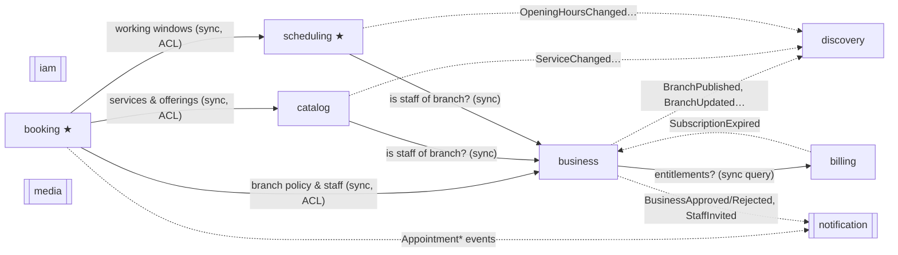
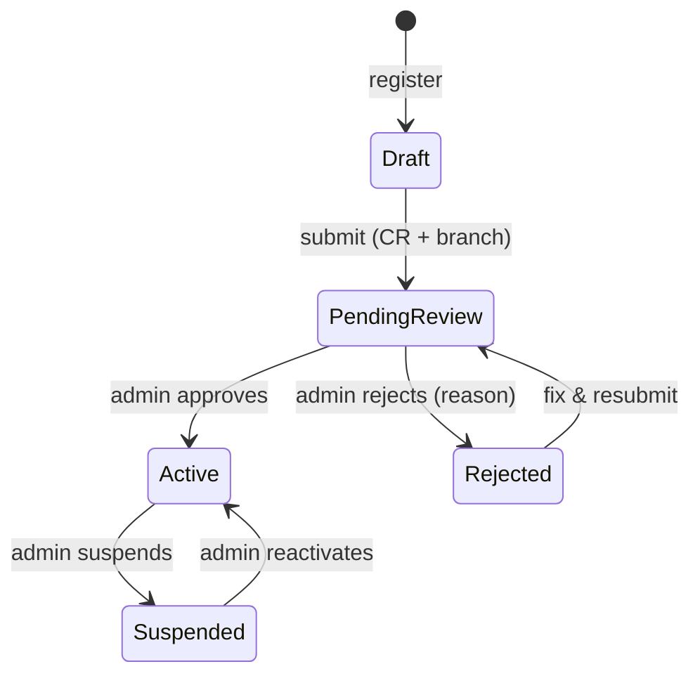
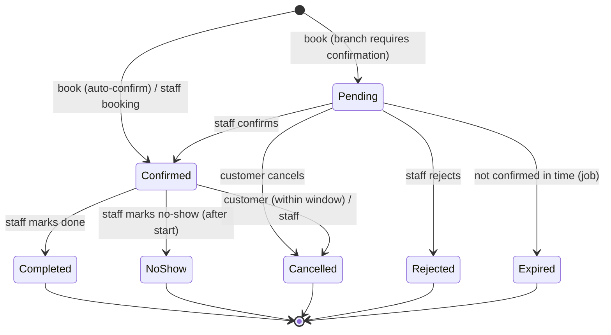

# Domain Model

This is the DDD heart of the project: the language we use, how the problem is split into bounded
contexts, and the rules (invariants) each context protects.

## 1. Ubiquitous language (English ↔ Arabic)

Use these words — and only these — in code, API, UI copy and conversations.

| Term | Arabic | Meaning |
|---|---|---|
| Business | المنشأة | The tenant. A legal entity (has a CR) that owns branches and pays a subscription. |
| Branch | الفرع | A physical barbershop with a location, opening hours, services and barbers. |
| Staff member | الموظف | A person working for a business: **owner**, **manager** or **barber**. |
| Barber | الحلاق | A staff member who performs services and has a schedule. |
| Customer | العميل | A person who books appointments. Any user can be a customer. |
| Service | الخدمة | Something a branch sells, e.g. haircut: a duration + a price. |
| Offering | تقديم الخدمة | "Barber X performs service Y" (optionally with his own price/duration). |
| Opening hours | أوقات الدوام | When a branch is open, per weekday. |
| Closure | إغلاق | A date range when a branch is closed (Eid, maintenance). |
| Working hours | ساعات العمل | When a barber works, per weekday; can be split and can pass midnight. |
| Time off | إجازة | A period a barber is unavailable. |
| Slot | موعد متاح | A start time a customer can book, computed — never stored. |
| Appointment | الحجز | A customer's commitment for a barber's time at a branch. |
| No-show | عدم حضور | Customer didn't come and didn't cancel. |
| Booking policy | سياسة الحجز | Per-branch rules: lead time, horizon, slot interval, buffer, cancellation window, auto-confirm. |
| Verification | التوثيق | Platform review of a business's CR and details. |
| Commercial Registration (CR) | السجل التجاري | Saudi business registration number (10 digits). |
| Plan / Subscription | الباقة / الاشتراك | What the business pays for; defines entitlements (limits). |
| Entitlement | الصلاحية | A limit granted by the plan, e.g. max branches. |

## 2. Subdomains and bounded contexts

| Context (Go module) | Subdomain type | Responsibility |
|---|---|---|
| `booking` | **Core** | Availability, appointments and their lifecycle |
| `scheduling` | **Core** | Branch calendars, barber schedules, time off — "when can work happen" |
| `business` | Supporting | Tenant onboarding & verification, branches (who/where), staff & roles |
| `catalog` | Supporting | Services, categories, offerings (what is sold, for how long, at what price) |
| `discovery` | Supporting | Public search read model: map, city, text, filters |
| `billing` | Supporting | Plans, subscriptions, entitlements |
| `iam` | Generic | Users, phone OTP, sessions/tokens |
| `notification` | Generic | Device tokens, templates, push/SMS delivery, reminders |
| `media` | Generic | Uploads (photos, CR documents), storage |

A rule of thumb for where something belongs: **Business = who & where · Catalog = what ·
Scheduling = when (possible) · Booking = when (committed)**.

### Context map



- **Solid arrows** — synchronous calls through the upstream module's small public API. The caller
  wraps it in its own port (an *anti-corruption layer*), so upstream types never leak into its domain.
- **Dotted arrows** — domain events delivered asynchronously through the transactional outbox
  ([ADR-0009](../adr/0009-domain-events-outbox-river.md)). Handlers are idempotent (at-least-once delivery).
- `iam` is used by everyone through the HTTP edge (the authenticated `Principal`), not called directly.

## 3. Contexts in detail

### 3.1 `iam` — Identity & Access

| Aggregate | Key fields | Invariants |
|---|---|---|
| `User` | id, phone (E.164), name, locale (`ar`/`en`), status, platform role (`none`/`admin`) | phone unique; blocked users cannot log in |
| `OTPChallenge` | phone, code hash, purpose, attempts, expires at, consumed at | 6 digits, TTL 5 min, max 5 attempts, resend cooldown 60 s, hourly cap per phone and per IP; single use |
| `Session` (refresh-token family) | id, user id, token hash, family id, device, expires at, revoked at | refresh tokens are single-use (rotated); reuse of an old token revokes the whole family |

Events: `UserRegistered`.

Authentication answers **who you are**. What you may do inside a business is decided by staff
membership in `business` (below) — the authorization check lives in each module's application layer.

### 3.2 `business` — Tenancy, onboarding, branches, staff

| Aggregate | Key fields | Invariants |
|---|---|---|
| `Business` | id, owner user id, display name {ar,en}, legal name, CR number, VAT number?, logo, status, verification (documents, submitted/reviewed at, reviewer, rejection reason) | CR is 10 digits and unique; only `Draft`/`Rejected` can be submitted; submission needs CR document + ≥ 1 branch with a location |
| `Branch` | id, business id, name {ar,en}, slug, city, district, address, location (lat/lng), phone, timezone (IANA), photos, status, **booking policy** | publishable only when business is `Active`, location set, ≥ 1 active service, ≥ 1 barber with working hours; branch count ≤ plan entitlement |
| `StaffMember` | id, business id, user id (null until invite accepted), role, branch ids, display name, avatar, bio, active | exactly one owner; barber count ≤ plan entitlement; a barber belongs to ≥ 1 branch |
| `Invitation` | business id, phone, role, branch ids, token hash, status, expires at | one pending invitation per phone per business |

**Business lifecycle**



**Booking policy** (value object on `Branch`, defaults in brackets): minimum lead time [30 min],
booking horizon [30 days], slot interval [15 min], buffer between appointments [0 min], customer
cancellation window [2 h before start], auto-confirm [yes], pending expiry if not auto-confirm [15 min],
max active future bookings per customer at this branch [2].

Events: `BusinessRegistered`, `BusinessSubmittedForReview`, `BusinessApproved`, `BusinessRejected`,
`BusinessSuspended`, `BusinessReactivated`, `BranchCreated`, `BranchUpdated`, `BranchPublished`,
`BranchUnpublished`, `StaffInvited`, `StaffJoined`, `StaffDeactivated`.

### 3.3 `catalog` — Services and offerings

| Aggregate | Key fields | Invariants |
|---|---|---|
| `Service` | id, business id, branch id, category, name {ar,en}, description, duration, price (Money, VAT-inclusive), active, sort order, **offerings** [{staff id, price override?, duration override?}] | duration 5–480 min in 5-min steps; price ≥ 0; Arabic name required; offerings only for barbers of that branch |
| `Category` (platform reference data) | code, name {ar,en}, icon | managed by platform admins (Haircut, Beard, Shave, Kids, Skin care, Colour, Packages) |

Events: `ServiceCreated`, `ServiceUpdated`, `ServiceDeactivated`.

### 3.4 `scheduling` — When work *can* happen ★

| Aggregate | Key fields | Invariants |
|---|---|---|
| `BranchCalendar` | branch id, timezone, weekly opening hours, closures [date range, reason] | intervals per day don't overlap; closures don't overlap |
| `BarberSchedule` | staff id, branch id, weekly template (weekday → intervals), date overrides (custom hours / day off), time off [instant ranges] | intervals don't overlap; an interval may **cross midnight** (e.g. Thu 16:00 → Fri 02:00 is one shift that starts on Thursday) |

Time modelling (see also [persistence](persistence.md#time)):

- Weekly templates are **branch-local wall-clock** (`weekday`, `start minute`, `duration`), because
  "we open at 4 pm" must stay 4 pm whatever the UTC offset.
- Time off and appointments are **instants** (UTC `timestamptz`).
- Converting a template into concrete windows happens per date in the branch `time.Location`.
- Barber working windows are *intersected* with branch opening hours at calculation time (a barber
  can't work when the branch is closed); the UI warns when they don't fit.

Public API used by `booking`: `WorkingWindows(ctx, branchID, staffIDs, from, to) → map[staffID][]Interval`.

Events: `OpeningHoursChanged`, `ClosureAdded`, `BarberScheduleChanged`, `TimeOffAdded`, `TimeOffRemoved`.

### 3.5 `booking` — Appointments ★

| Aggregate | Key fields |
|---|---|
| `Appointment` | id, business id, branch id, barber id, customer id, **items** [service id, name snapshot {ar,en}, duration, price], total duration, total price, start/end (UTC), status, source (`customer_app` / `staff`), assignment (`requested_barber` / `any_barber`), customer note, cancellation {by, reason, at}, version |

Items are **snapshots** — if the shop changes the price tomorrow, today's booking keeps its price.

**Appointment lifecycle**



**Invariants**

1. A barber never has two *active* (`Pending`/`Confirmed`) appointments that overlap —
   enforced by the database ([ADR-0008](../adr/0008-double-booking-exclusion-constraint.md)).
2. The whole appointment `[start, start + total duration + buffer)` fits inside one working window of the barber.
3. The barber has an offering for **every** item (v1: one barber performs all items, back-to-back).
4. `start ≥ now + lead time` and `start ≤ today + horizon` (branch-local) for customer bookings;
   staff bookings may bypass lead time.
5. The branch is published and the business is `Active`.
6. The customer has fewer than *max active future bookings* at this branch.
7. Customer cancellation is only allowed until *cancellation window* before start; staff can always cancel.
8. Only valid state transitions (above); `Completed`/`NoShow` only after start time.

Events: `AppointmentBooked`, `AppointmentConfirmed`, `AppointmentRejected`, `AppointmentExpired`,
`AppointmentCancelled`, `AppointmentCompleted`, `AppointmentMarkedNoShow`.

#### Availability algorithm (domain service, pure function)

Input: branch policy + timezone, date (branch-local), selected services, barber = specific | any,
`now`, and — provided by ports — each candidate barber's working windows and busy intervals.

```
duration   = Σ item durations for that barber (offering overrides apply) + buffer
candidates = barbers of the branch who offer ALL selected services
             (or just the requested barber)
for each candidate:
    windows = working windows on date                       // scheduling, already ∩ opening hours
    free    = windows − busy (active appointments, time off)
    for t in grid(date, slot interval) where t ≥ now + lead time:
        if [t, t + duration) ⊆ some interval in free → slot(t, barber)
specific barber → slots of that barber
any barber      → union of start times; each keeps the list of barbers free at t
```

- Complexity is tiny (one branch-day, a handful of barbers) — the win is **correctness**, so it's
  a pure function covered by table-driven tests + Go native **fuzzing** (e.g. "no returned slot ever
  overlaps a busy interval", "every slot is inside a window").
- Slots are **advisory**: between showing a slot and booking it someone else may take it. The
  exclusion constraint is the source of truth → `409 slot_unavailable` → the app refreshes slots.
- **Any-barber assignment** (`BarberAssigner` domain service): among barbers free at `t`, pick the one
  with the fewest booked minutes that day (spreads load fairly); tie → stable order by id.
  If the insert hits the constraint, try the next free barber before giving up.

### 3.6 `discovery` — Search read model

A denormalised `branch_listing` per published branch: names {ar,en} (+ normalised search text),
city, district, location (PostGIS `geography(Point, 4326)`), cover photo, price-from, category codes,
weekly opening hours (for *open now*), rating (later). Built only from events — `discovery` never
reads other modules' tables.

Queries: nearby (radius + distance order), by city/district, text search (trigram on normalised
Arabic/English names), filters (category, open now, price), sort (distance, price; rating later).

Arabic normalisation for search: strip diacritics/tatweel, unify alef forms (أ إ آ → ا), ى → ي,
ة → ه — applied both when indexing and when querying.

### 3.7 `billing` — Plans and entitlements

| Aggregate | Key fields | Invariants |
|---|---|---|
| `Plan` (reference data) | code, name {ar,en}, entitlements {max branches, max barbers}, price monthly/yearly | — |
| `Subscription` | business id, plan code, status (`trialing`/`active`/`past_due`/`cancelled`/`expired`), current period | one live subscription per business |

v1: an approved business starts a trial on the top plan, then falls back to Free; platform admins can
assign plans manually. Public API: `Entitlements(ctx, businessID)`. On `SubscriptionExpired`, `business`
unpublishes branches beyond the Free limit (never deletes data). Online payment collection and ZATCA
e-invoicing come later.

### 3.8 `notification`

Device tokens (user, platform, token, locale), ar/en templates, delivery log. Reacts to events:

| Event | Who is notified |
|---|---|
| `AppointmentBooked` | branch staff (+ barber); customer if auto-confirmed |
| `AppointmentConfirmed` / `Rejected` / `Expired` | customer |
| `AppointmentCancelled` | the other party |
| reminder job (start − 1 h; later − 24 h) | customer — the job re-checks status when it fires, so a cancelled booking sends nothing |
| `BusinessApproved` / `Rejected` | owner |
| `StaffInvited` | invitee (SMS with deep link) |

Ports: `PushSender` (FCM), `SMSSender` (console in dev → provider in M7), later `WhatsAppSender`, `EmailSender`.

### 3.9 `media`

Uploads for logos, branch photos, avatars (public) and CR documents (private — served only through
short-lived signed URLs to the owner and platform admins). Validates type and size. Storage port:
local disk in development → S3-compatible (S3 / R2) later.

## 4. Authorization model

```
Principal (from JWT): user id, platform role
Membership (from business): user → business, role, branch ids

customer   — own profile, own appointments, public reads
barber     — own schedule/time off, appointments assigned to them, confirm/complete/no-show them
manager    — everything in their branch(es): services, schedules, staff bookings, policy
owner      — everything in the business: branches, staff, billing, verification
platform admin — approve/reject/suspend businesses, plans, reference data
```

Checks live in the **application layer** of each module (a `Policy` per use case), never in HTTP
handlers only. Every business-mode request carries the tenant in the path
(`/v1/businesses/{businessId}/…`) and the membership check is the first thing the use case does.
