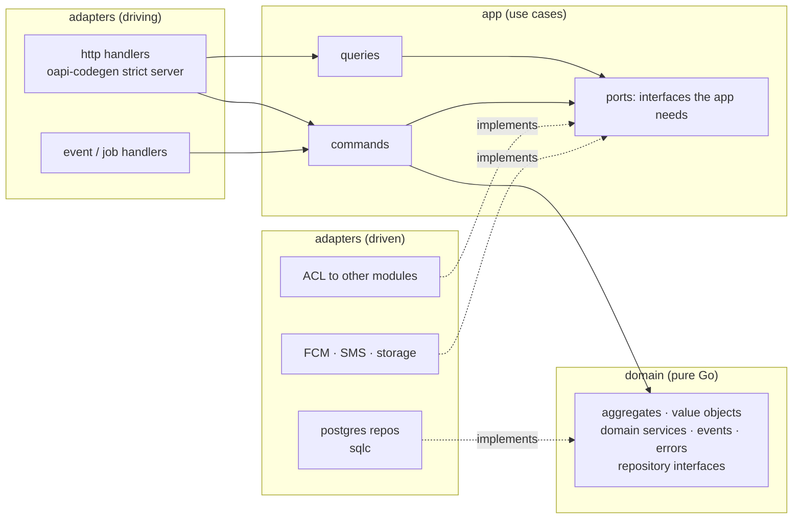

# Architecture Overview

A **modular monolith**: one Go binary, many modules, each module is a DDD bounded context with
hexagonal (ports & adapters) layers inside. Deployed as one process (API) plus workers (can be the same
binary with a flag). Modules could be extracted into services later because they already talk only
through public APIs and events — but we don't pay that cost now ([ADR-0002](../adr/0002-modular-monolith.md)).

## 1. Layers inside a module



| Layer | May import | Must not import | Contains |
|---|---|---|---|
| `domain` | stdlib, `internal/shared` | pgx, net/http, JSON tags, other modules, `platform` | aggregates, value objects, domain services, domain events, sentinel errors, repository interfaces |
| `app` | own `domain`, `internal/shared`, `internal/platform` interfaces | adapters, other modules' internals | command/query handlers, ports, authorization policies, transaction boundaries |
| `adapters` | everything the module needs | other modules' `domain` / `app` / `adapters` | HTTP mapping, sqlc repositories, ACL clients, external providers |
| `module.go` | all of the module | — | wiring: `New(deps) *Module`, routes, event subscriptions, the module's **public API** |

Dependency direction always points **inward** (adapters → app → domain). The domain has no idea
Postgres or HTTP exist — that's what makes it easy to test and to reason about.

## 2. Repository layout (target)

```
barbershop-backend/
├── cmd/
│   └── server/main.go            # wires config, db, modules; runs `api` or `worker` (flag)
├── api/
│   └── openapi.yaml              # HTTP contract — source of truth (Flutter client is generated from it)
├── internal/
│   ├── platform/                 # technical plumbing, zero business rules
│   │   ├── config/               # env → typed config, validated at startup
│   │   ├── database/             # pgx pool, tx helpers
│   │   ├── httpx/                # router, middleware (request id, logging, recover, auth, rate limit), problem+json
│   │   ├── auth/                 # JWT verification, Principal in context
│   │   ├── events/               # event envelope, outbox publisher, dispatcher (River)
│   │   ├── jobs/                 # River client & worker registration
│   │   ├── clock/                # Clock interface (real + fake for tests)
│   │   └── i18n/                 # locale from Accept-Language, message catalogs
│   ├── shared/                   # shared kernel — tiny, stable value objects only
│   │   └── ids.go money.go phone.go localized.go geo.go interval.go
│   ├── iam/
│   ├── business/
│   ├── catalog/
│   ├── scheduling/
│   ├── booking/                  # expanded below
│   ├── discovery/
│   ├── billing/
│   ├── notification/
│   └── media/
├── migrations/                   # goose SQL migrations (forward-only once merged)
├── deploy/
│   └── docker-compose.yml        # PostGIS (+ app later)
├── docs/                         # you are here
├── sqlc.yaml
├── Makefile
├── .golangci.yml
└── go.mod
```

One module expanded:

```
internal/booking/
├── domain/
│   ├── appointment.go            # aggregate root: unexported fields, behaviour methods
│   ├── appointment_test.go
│   ├── status.go                 # state machine
│   ├── availability.go           # pure domain service
│   ├── availability_test.go      # table-driven
│   ├── availability_fuzz_test.go # Go native fuzzing
│   ├── assigner.go               # "any barber" strategy
│   ├── events.go
│   ├── errors.go                 # ErrSlotUnavailable, ErrOutsideCancellationWindow, …
│   └── repository.go             # AppointmentRepository interface
├── app/
│   ├── command/                  # BookAppointment, CancelAppointment, ConfirmAppointment, …
│   ├── query/                    # AvailableSlots, MyAppointments, BranchDay, …
│   ├── ports.go                  # SchedulingReader, CatalogReader, BranchReader, Clock …
│   └── policy.go                 # who may do what
├── adapters/
│   ├── http/                     # handlers + DTO ↔ command mapping
│   ├── postgres/
│   │   ├── queries.sql           # sqlc input
│   │   ├── sqlcgen/              # generated — never edited by hand
│   │   └── repository.go         # rows ↔ domain (Rehydrate)
│   └── acl/                      # implements ports by calling scheduling/catalog/business public APIs
└── module.go                     # New(), RegisterRoutes(), public API for other modules
```

## 3. Module boundary rules (checked in CI)

1. A module may import another module **only through its root package** (`internal/scheduling`),
   which exposes a small interface and plain DTOs — never `internal/scheduling/domain|app|adapters`.
2. No module reads or writes another module's tables. Each module owns a Postgres schema
   (`booking.appointments`, `catalog.services`, …) and cross-module data flows via public API calls or events.
3. `internal/shared` holds only small, stable value objects everyone agrees on. When in doubt, don't share.
4. `internal/platform` has no business rules.

Enforced with `depguard` rules in golangci-lint (and/or `go-arch-lint`), so a violating import fails CI.

## 4. Tactical DDD in idiomatic Go

```go
// Aggregate: unexported fields + constructor that enforces invariants + behaviour methods.
type Appointment struct {
    id       AppointmentID
    barberID shared.StaffID
    slot     shared.Interval
    status   Status
    events   []Event // recorded, published by the repository in the same transaction
}

func (a *Appointment) Cancel(by Actor, now time.Time, p CancellationPolicy) error {
    if !a.status.CanTransitionTo(StatusCancelled) {
        return ErrInvalidTransition
    }
    if by.IsCustomer() && now.After(a.slot.Start().Add(-p.Window)) {
        return ErrOutsideCancellationWindow
    }
    a.status = StatusCancelled
    a.record(AppointmentCancelled{ID: a.id, By: by, At: now})
    return nil
}
```

- **Value objects** are immutable types with constructors returning `(T, error)`:
  `shared.NewPhoneNumber("+9665…")`, `shared.NewMoney(6000, "SAR")`.
- **Rehydration**: repositories rebuild aggregates with an explicit `UnmarshalFromDB`/`Rehydrate`
  function that skips "new object" rules — the constructor stays strict.
- **Update-function pattern** for changing an aggregate atomically:
  `repo.Update(ctx, id, func(a *Appointment) error { return a.Cancel(...) })` — the repository opens
  a transaction, loads with `SELECT … FOR UPDATE`, calls the function, saves, and writes the recorded
  events to the outbox in the **same transaction**.
- **Commands** return only an error (and maybe an ID); **queries** return read DTOs and may read
  straight from optimised SQL — no need to load aggregates to show a list.

## 5. Go conventions for this codebase

| Topic | Rule |
|---|---|
| Errors | Values, not exceptions. Wrap with context: `fmt.Errorf("book appointment: %w", err)`. Domain errors are sentinels/typed errors checked with `errors.Is/As`, translated to HTTP only at the edge. No `panic` for control flow. |
| Context | `ctx context.Context` is the first parameter of anything that does I/O. Never stored in structs. |
| Interfaces | Small, defined where they are **used** (the consumer), not where implemented. Accept interfaces, return structs. |
| Dependencies | Explicit constructor injection, wired by hand in `main`. No DI container, no globals, no `init()` side effects. |
| Packages | Short lowercase names by responsibility (`booking`, `httpx`); no `utils`, `common`, `helpers`. |
| Time | Domain never calls `time.Now()` — it receives `now` or a `Clock`. Instants in UTC; wall-clock schedules in branch timezone. |
| Money | `int64` minor units (halalas) + currency. Never `float64`. |
| IDs | UUIDv7 (time-ordered, index-friendly), typed per aggregate (`type BranchID uuid.UUID`). |
| Logging | `log/slog`, JSON, structured attrs (`request_id`, `user_id`, `business_id`). Never log OTPs, tokens or full phone numbers. |
| Concurrency | Only where it pays (e.g. `errgroup` for parallel reads). Every goroutine has an owner and a way to stop. Tests run with `-race`. |
| Generated code | `sqlc` and `oapi-codegen` output is committed, never edited by hand; CI checks it's up to date. |
| Formatting | `gofumpt` + `goimports`; golangci-lint must pass. |

## 6. Cross-cutting concerns

- **Transport errors** — RFC 9457 `application/problem+json` with a stable machine `code`
  (`slot_unavailable`, `otp_invalid`, …) and localised `title`/`detail` (Accept-Language).
- **Validation** — twice, on purpose: request shape via the OpenAPI schema at the edge; business
  rules in domain constructors and methods.
- **Transactions & outbox** — domain events are inserted as River jobs in the same transaction as the
  state change; workers deliver them to subscribers in other modules ([ADR-0009](../adr/0009-domain-events-outbox-river.md)).
- **Background jobs** — River (Postgres-backed): event delivery, reminders, pending-booking expiry,
  subscription expiry. No Redis needed in v1.
- **Idempotency** — `Idempotency-Key` header on creating endpoints; stored with the response for 24 h.
- **Security** — object-level authorization in every use case (OWASP API #1: BOLA), rate limits on
  OTP and search, request size limits, `gosec` + `govulncheck` in CI, secrets only from env.
- **Observability** — slog now; `/healthz` (liveness) and `/readyz` (DB reachable); OpenTelemetry
  traces/metrics in M8.
- **Configuration** — 12-factor: env vars only, parsed into a typed struct and validated at startup
  (fail fast).
- **Graceful shutdown** — `signal.NotifyContext`, `http.Server.Shutdown`, River stop with timeout.

## 7. Tech stack

| Concern | Choice | Node.js equivalent you know |
|---|---|---|
| Language | Go (latest stable, pinned in `go.mod`) | Node + TypeScript |
| HTTP | `net/http` + [chi](https://github.com/go-chi/chi) (100 % net/http compatible) | Express |
| API contract | OpenAPI 3.0 + [oapi-codegen](https://github.com/oapi-codegen/oapi-codegen) (strict server) | swagger-jsdoc / tsoa |
| DB driver | [pgx v5](https://github.com/jackc/pgx) | pg / postgres.js |
| Queries | [sqlc](https://sqlc.dev) — write SQL, get type-safe Go | Prisma / Kysely |
| Migrations | [goose](https://github.com/pressly/goose) | prisma migrate / knex |
| Jobs + outbox | [River](https://riverqueue.com) (Postgres) | BullMQ (Redis) |
| Auth | [golang-jwt v5](https://github.com/golang-jwt/jwt) (EdDSA), `crypto/*` stdlib | jsonwebtoken / bcrypt |
| Phone numbers | [nyaruka/phonenumbers](https://github.com/nyaruka/phonenumbers) | libphonenumber-js |
| Config | [caarlos0/env](https://github.com/caarlos0/env) | dotenv + zod |
| Logging | `log/slog` (stdlib) | pino / winston |
| Push | Firebase Admin SDK for Go (FCM) | firebase-admin |
| Tests | `testing` + [go-cmp](https://github.com/google/go-cmp) + [testcontainers-go](https://golang.testcontainers.org) | jest + supertest |
| Lint | [golangci-lint](https://golangci-lint.run) (+ depguard, gosec, revive, errcheck) | eslint |
| Live reload | [air](https://github.com/air-verse/air) | nodemon |
| Local infra | Docker Compose with `postgis/postgis` | docker compose |

## 8. Testing strategy

| Level | What | Tools | Share |
|---|---|---|---|
| Domain unit | aggregates, value objects, availability, state machines | `testing`, table-driven, **fuzzing** | most tests |
| Application | use cases with in-memory fakes of ports | `testing`, fake clock | many |
| Integration | repositories, SQL, constraints (e.g. the exclusion constraint really rejects overlaps) | testcontainers (PostGIS) | some |
| End-to-end | critical HTTP flows: login → search → book → cancel | real server + DB | few |

`go test -race ./...` in CI. Concurrency test for booking: N goroutines book the same slot → exactly
one succeeds.
