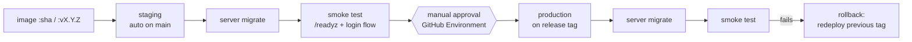

# CI/CD — the pipeline lifecycle

How a change travels from your editor to a released, runnable artifact — and later to staging and
production. Pipelines are code (`.github/workflows/`), reviewed like any other change
([ADR-0011](../adr/0011-ci-cd-github-actions.md)).

> **Now:** CI on every PR + CD that publishes a scanned, attested, versioned Docker image and a GitHub
> Release. You run any version locally with Docker Compose.
> **Later:** a deploy stage (staging → production) plugs in at the end once hosting is chosen —
> nothing before it changes.

## 1. The lifecycle at a glance

```mermaid
flowchart LR
  subgraph Dev["1 · Develop"]
    C[commit on a short-lived branch<br/>Conventional Commits]
    L[make check<br/>same checks as CI]
  end
  subgraph CI["2 · Verify (PR)"]
    Q[lint · format · vet<br/>generated code in sync]
    T[tests -race<br/>PostGIS service]
    S[security<br/>govulncheck · gitleaks · CodeQL]
    B[build binary + image<br/>no push]
  end
  subgraph Gate["3 · Review & merge"]
    R[required checks green<br/>squash merge]
  end
  subgraph CD["4 · Deliver (main)"]
    I[build image ONCE<br/>multi-arch]
    V[scan image<br/>Trivy]
    A[attest<br/>provenance + SBOM]
    P[push GHCR<br/>:sha-abc1234]
  end
  subgraph Rel["5 · Release"]
    RP[release-please PR<br/>version + changelog]
    TG[tag vX.Y.Z<br/>GitHub Release]
    PR2[promote same image<br/>:vX.Y.Z · :X.Y · :latest]
  end
  subgraph Run["6 · Run"]
    LOC[local: compose pull && up]
    DEP[staging → prod<br/>later]
  end
  C --> L --> Q --> T --> S --> B --> R --> I --> V --> A --> P --> RP --> TG --> PR2 --> LOC
  PR2 -.-> DEP
```



## 2. Principles

| Principle | What it means here |
|---|---|
| **Pipeline as code** | Workflows live in the repo, change through PRs, and are reviewed. |
| **Fail fast** | Cheapest checks first (format, lint) so most mistakes fail in ~1 minute. Target: whole PR pipeline < 10 min. |
| **Build once, promote** | The image is built once per commit on `main`. Releases *re-tag* that exact image — what you tested is what you ship. |
| **Immutable artifacts** | `:sha-<commit>` and `:vX.Y.Z` tags are never overwritten; only moving tags (`:main`, `:latest`, `:X.Y`) move. |
| **Reproducible** | Go version pinned in `go.mod` (`toolchain`), actions pinned by commit SHA, Docker base images pinned by digest; Dependabot bumps them via PRs. |
| **Least privilege** | Every workflow declares minimal `permissions:`; publishing uses the built-in `GITHUB_TOKEN`/OIDC — no long-lived secrets. |
| **Local parity** | `make check` runs the same lint/test/build as CI, so CI surprises are rare. |
| **Secure supply chain** | Dependency, secret, code and image scanning, plus signed provenance and an SBOM for every image. |

## 3. Branching, commits and versions

- **Trunk-based**: `main` is always releasable; work on short-lived branches (≤ a few days), one concept per PR.
- **Conventional Commits** in PR titles (squash merge makes the PR title the commit message):
  `feat(booking): any-barber assignment`, `fix(iam): refresh token reuse detection`, `docs:`, `test:`,
  `refactor:`, `ci:`, `chore:`. A breaking change is marked `feat!:` / `BREAKING CHANGE:`. CI checks the title.
- **SemVer** driven by those commits via release-please: `fix` → patch, `feat` → minor, breaking → major
  (while in `0.x`, breaking → minor). `v1.0.0` = first real launch.
- **Branch ruleset on `main`**: PR required, required status checks green, linear history, no force-push,
  no deletion. (As a solo owner you can't approve your own PR — checks are the gate; reviewers are added when the team grows.)

## 4. Workflows

| Workflow | Trigger | Jobs | Arrives in |
|---|---|---|---|
| `ci.yml` | pull request, push to `main` | `lint` (`go mod tidy -diff`, golangci-lint incl. gofumpt/goimports, module-boundary + gosec rules, `go vet`) · `generated` (from M2: sqlc + oapi-codegen regenerate → `git diff --exit-code`, OpenAPI lint) · `test` (`go test -race -cover` against a PostGIS service container; migrations applied from scratch) · `build` (static `go build`; Docker build without push from M1.5) | M1 |
| `pr-title.yml` | pull request | Conventional Commit title check | M1 |
| `dependabot.yml` (config) | weekly | Go modules, GitHub Actions, Docker base image | M1 |
| `security.yml` | pull request, weekly | `govulncheck`, `gitleaks` (secrets), dependency review (new vulnerable/incompatible-licence deps), **CodeQL** (Go SAST) | M1.5 |
| `cd.yml` | push to `main` | buildx multi-arch image (`linux/amd64`, `linux/arm64`) → **Trivy** scan (fail on fixable HIGH/CRITICAL) → provenance + SBOM **attestations** → push `ghcr.io/abdulkhaliq-84/barbershop-backend:sha-<commit>` and `:main` | M1.5 |
| `release.yml` | push to `main` | **release-please** keeps a Release PR (version bump + `CHANGELOG.md`); when merged → tag `vX.Y.Z` + GitHub Release → promote the image built for that commit to `:vX.Y.Z`, `:X.Y`, `:latest` | M1.5 |
| `deploy.yml` | tag / manual | staging (auto) → production (manual approval) — see §7 | when hosting is chosen |

Jobs that don't depend on each other run in parallel; Go module and build caches keep them fast.

## 5. The artifact

- **One binary, several roles**: `server api`, `server worker`, `server migrate` (runs goose + River migrations).
- **Dockerfile**: multi-stage — `golang` builder (`CGO_ENABLED=0`, `-trimpath`, `-ldflags "-s -w -X …"`) →
  `gcr.io/distroless/static` **nonroot** runtime. Small, no shell, no package manager to exploit.
- **Build info**: commit SHA, version (from release-please's manifest at that commit) and build time are
  embedded and served at `GET /version`, and set as OCI image labels.
- **Run a release locally**:

  ```bash
  BARBERSHOP_IMAGE=ghcr.io/abdulkhaliq-84/barbershop-backend:v0.3.0 docker compose up -d
  gh attestation verify oci://ghcr.io/abdulkhaliq-84/barbershop-backend:v0.3.0 -R Abdulkhaliq-84/barbershop-backend
  ```

## 6. Secrets and configuration

- CI needs **no secrets** today: tests use a throwaway PostGIS container; GHCR uses `GITHUB_TOKEN`.
- Runtime config is env vars only (12-factor). Real secrets (JWT keys, SMS/FCM credentials) will live in
  the hosting platform's secret store and **GitHub Environments** secrets — never in the repo, never in the image.
- `gitleaks` blocks accidental commits of keys.

## 7. The deploy stage (later)

When hosting is chosen, `deploy.yml` adds the last stages without changing anything above:



- **Migrations before rollout**, always backward compatible (expand → migrate → contract), so the
  previous version still runs against the new schema — that is what makes rollback a simple redeploy.
- **Rollback** = redeploy the previous immutable tag. **Fix forward** = a normal PR through the whole pipeline.
- **Measure the pipeline** with the four DORA metrics: deployment frequency, lead time for changes,
  change failure rate, time to restore.

## 8. Node.js → Go mapping

| You know (Node) | Here (Go) |
|---|---|
| `npm ci` + cache | `go mod download` + Go build/module cache |
| eslint / prettier | golangci-lint / gofumpt |
| jest --coverage | `go test -race -cover` |
| `npm audit` | `govulncheck` (only reports vulnerabilities in code paths you actually call) |
| semantic-release | release-please |
| husky pre-commit | `make check` (optionally lefthook) |
| node:alpine image | distroless static image (no runtime needed — Go is a single static binary) |

## 9. Learning path

| Step | You will learn |
|---|---|
| M1 — `ci.yml` | Workflow anatomy (triggers, jobs, steps, matrices, service containers), caching, required checks, reading failed logs |
| M1.5 — `cd.yml` + `release.yml` | Artifacts vs. source, image tags and immutability, multi-arch builds, scanning, attestations/SBOM, SemVer + changelogs, promotion |
| Hosting milestone — `deploy.yml` | Environments, approvals, migrations in deploys, smoke tests, rollback, DORA metrics |
| Anytime | Run workflows locally with [`act`](https://github.com/nektos/act) to iterate faster |
