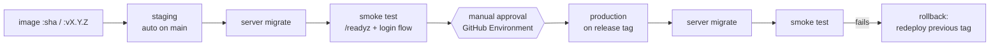

# CI/CD — the pipeline lifecycle

How a change travels from your editor to a released, runnable artifact — and later to staging and
production. Pipelines are code (`.github/workflows/`), reviewed like any other change
([ADR-0011](../adr/0011-ci-cd-github-actions.md)).

> **Now:** CI on every PR + CD that publishes a scanned, attested, versioned Docker image and a GitHub
> Release. You run any version locally with Docker Compose.
> **Later:** a deploy stage (staging → production) plugs in at the end once hosting is chosen —
> nothing before it changes.

## 1. The lifecycle at a glance


```mermaid
flowchart LR
  subgraph Dev["1 · Develop"]
    C[commit on a short-lived branch<br/>Conventional Commits]
    L[make check<br/>same checks as CI]
  end
  subgraph CI["2 · Verify (PR)"]
    Q[lint · format · vet<br/>generated code in sync]
    T[tests -race<br/>PostGIS service]
    S[security<br/>govulncheck · gitleaks · CodeQL]
    B[build binary + image scans<br/>no push]
  end
  subgraph Gate["3 · Review & merge"]
    R[required checks green<br/>squash merge]
  end
  subgraph CD["4 · Deliver (main)"]
    I[build delivery image<br/>multi-arch]
    V[scan image<br/>Trivy]
    A[attest<br/>provenance + SBOM]
    P[push GHCR<br/>:sha-full-commit]
  end
  subgraph Rel["5 · Release"]
    RP[release-please PR<br/>version + changelog]
    TG[tag vX.Y.Z<br/>GitHub Release]
    PR2[promote same image<br/>:vX.Y.Z · :X.Y · :latest]
  end
  subgraph Run["6 · Run"]
    LOC[local: compose pull && up]
    DEP[staging → prod<br/>later]
  end
  C --> L --> Q --> T --> S --> B --> R --> I --> V --> A --> P --> RP --> TG --> PR2 --> LOC
  PR2 -.-> DEP
```

## 2. Principles

| Principle | What it means here |
|---|---|
| **Pipeline as code** | Workflows live in the repo, change through PRs, and are reviewed. |
| **Fail fast** | Cheapest checks first (format, lint) so most mistakes fail in ~1 minute. Target: whole PR pipeline < 10 min. |
| **Build once, promote** | The delivery image is published once per commit on `main`; retries reuse its digest. Releases re-tag it without rebuilding. Separate read-only jobs build both architectures for scanning. |
| **Immutable artifacts** | `:sha-<commit>` and `:vX.Y.Z` tags are never overwritten; only moving tags (`:main`, `:latest`, `:X.Y`) move. |
| **Reproducible** | Go version pinned in `go.mod`, actions pinned by commit SHA, Docker base images pinned by digest; Dependabot bumps them via PRs. |
| **Least privilege** | Every workflow declares minimal `permissions:`; publishing uses the built-in `GITHUB_TOKEN`/OIDC — no long-lived secrets. |
| **Local parity** | `make check` runs the same lint/test/build as CI, so CI surprises are rare. |
| **Secure supply chain** | Dependency, secret, code and image scanning, plus signed provenance and an SBOM for every image. |

## 3. Branching, commits and versions

- **Trunk-based**: `main` is always releasable; work on short-lived branches (≤ a few days), one concept per PR.
- **Conventional Commits** in PR titles (squash merge makes the PR title the commit message):
  `feat(booking): any-barber assignment`, `fix(iam): refresh token reuse detection`, `docs:`, `test:`,
  `refactor:`, `ci:`, `chore:`. A breaking change is marked `feat!:` / `BREAKING CHANGE:`. CI checks the title.
- **SemVer** driven by those commits via release-please: `fix` → patch, `feat` → minor, breaking → major
  (while in `0.x`, breaking → minor). `v1.0.0` = first real launch. The first release is `v0.1.0`
  (`initial-version` in `release-please-config.json`: without it release-please starts at `1.0.0`).
- **Branch ruleset on `main`**: PR required, required status checks green, linear history, no force-push,
  no deletion. (As a solo owner you can't approve your own PR — checks are the gate; reviewers are added when the team grows.)

## 4. Workflows

| Workflow | Trigger | Jobs | Arrives in |
|---|---|---|---|
| `ci.yml` | pull request, push to `main` | `lint` (`go mod tidy -diff`, golangci-lint incl. gofumpt/goimports, module-boundary + gosec rules, `go vet`) · `test` (`go test -race -cover` against a PostGIS service container; migrations applied from scratch) · `build` (static `go build`), isolated `image-scan` (**Trivy** on amd64 and arm64), `release-guards` (promotion regression tests) · `generated` (`make generate`, then fail if the committed sqlc/oapi-codegen output differs) | M1 · image build M1.5 · generated M2.2 |
| `pr-title.yml` | pull request | Conventional Commit title check | M1 |
| `dependabot.yml` (config) | weekly | Go modules, GitHub Actions, Docker base images | M1 · docker M1.5 |
| `security.yml` | pull request, `main`, weekly | `govulncheck`, `gitleaks` (secrets, full history), dependency review (PRs), **CodeQL** (Go SAST → Security tab) | M1.5 |
| `cd.yml` | push to `main` | `release-please` (keeps the Release PR; on merge tags `vX.Y.Z` + GitHub Release) ; isolated `scan` gates `image` (build `linux/amd64`+`linux/arm64` → publish/reuse full `:sha-<commit>` with SBOM + provenance → GitHub **attestation** → current `:main`) → `promote` (release only: re-tag that digest as `:vX.Y.Z`, `:X.Y`, `:latest`) | M1.5 |
| `deploy.yml` | tag / manual | staging (auto) → production (manual approval) — see §7 | when hosting is chosen |

Jobs that don't depend on each other run in parallel; Go module and build caches keep them fast.

## 5. The artifact

- **One binary, several roles**: `server api`, `server migrate` (goose; River's migrations join in M3), `server worker` (M3).
- **Dockerfile**: multi-stage — `golang` builder on `$BUILDPLATFORM` cross-compiling with `GOOS/GOARCH`
  (`CGO_ENABLED=0`, `-trimpath`, `-ldflags "-s -w -X main.version=…"`) → `gcr.io/distroless/static-debian13`
  **nonroot** runtime. ~6 MB to download, no shell, no package manager to exploit. Base images pinned by digest.
- **Version**: `sha-<full commit>` (stable across retries) is stamped into `main.version` and logged at startup;
  OCI source and revision labels identify the repository and exact commit. (`GET /version` is the M1 exercise.)
- **Supply chain**: BuildKit attaches an SBOM and max-mode provenance to every pushed image, and a GitHub
  artifact attestation (Sigstore-signed via OIDC) proves which workflow built which digest.
- **Run an image locally**:

  ```bash
  make docker-build && make app-up BARBERSHOP_IMAGE=barbershop-backend:local        # what you just built
  make app-up BARBERSHOP_IMAGE=ghcr.io/abdulkhaliq-84/barbershop-backend:v0.1.0      # a release
  gh attestation verify oci://ghcr.io/abdulkhaliq-84/barbershop-backend:v0.1.0 -R Abdulkhaliq-84/barbershop-backend
  docker buildx imagetools inspect ghcr.io/abdulkhaliq-84/barbershop-backend:v0.1.0 --format '{{ json .SBOM }}'
  ```

### One-time repository settings

| Setting | Why |
|---|---|
| Settings → Advanced Security → **Dependency graph → Enable** | the `Dependency review` check fails with "not supported on this repository" until it is on |
| Settings → Actions → General → Workflow permissions → **Allow GitHub Actions to create and approve pull requests** | release-please opens the Release PR with `GITHUB_TOKEN`; without this the `Release PR / tag` job fails |
| Settings → Rules → Rulesets → `main`: require PR, linear history, block force pushes/deletion; require **Lint, Test, Build, Generated code, Conventional Commit title, govulncheck, Secrets (gitleaks), Dependency review, CodeQL (Go), Release guards**, and both **Image security / Trivy (amd64/arm64)** checks | protects main; select actual emitted check names. Avoid blanket admin bypass. Bot-created PRs may need a maintainer close/reopen to trigger checks, or a GitHub App token later. |
| Settings → Rules → Rulesets → tags `v*`: restrict updates/deletions without a bypass; Settings → General → Releases → **Enable release immutability** | prevents release Git tags being moved outside the workflow; applies to new immutable releases |
| Packages → `barbershop-backend` → Package settings → **Change visibility → Public** (after the first publish) | lets anyone `docker pull` without logging in to GHCR |

## 6. Secrets and configuration

- CI needs **no secrets** today: tests use a throwaway PostGIS container; GHCR uses `GITHUB_TOKEN`.
- Runtime config is env vars only (12-factor). Real secrets (JWT keys, SMS/FCM credentials) will live in
  the hosting platform's secret store and **GitHub Environments** secrets — never in the repo, never in the image.
- `gitleaks` blocks accidental commits of keys.

## 7. The deploy stage (later)

When hosting is chosen, `deploy.yml` adds the last stages without changing anything above:


```mermaid
flowchart LR
  IMG[image :sha / :vX.Y.Z] --> ST[staging<br/>auto on main]
  ST --> MIG1[server migrate] --> SM1[smoke test<br/>/readyz + login flow]
  SM1 --> APPROVE{{manual approval<br/>GitHub Environment}}
  APPROVE --> PRD[production<br/>on release tag]
  PRD --> MIG2[server migrate] --> SM2[smoke test]
  SM2 -- fails --> RB[rollback:<br/>redeploy previous tag]
```

- **Migrations before rollout**, always backward compatible (expand → migrate → contract), so the
  previous version still runs against the new schema — that is what makes rollback a simple redeploy.
- **Rollback** = redeploy the previous immutable tag. **Fix forward** = a normal PR through the whole pipeline.
- **Measure the pipeline** with the four DORA metrics: deployment frequency, lead time for changes,
  change failure rate, time to restore.

## 8. Node.js → Go mapping

| You know (Node) | Here (Go) |
|---|---|
| `npm ci` + cache | `go mod download` + Go build/module cache |
| eslint / prettier | golangci-lint / gofumpt |
| jest --coverage | `go test -race -cover` |
| `npm audit` | `govulncheck` (only reports vulnerabilities in code paths you actually call) |
| semantic-release | release-please |
| husky pre-commit | `make check` (optionally lefthook) |
| node:alpine image | distroless static image (no runtime needed — Go is a single static binary) |

## 9. Learning path

| Step | You will learn |
|---|---|
| M1 — `ci.yml` | Workflow anatomy (triggers, jobs, steps, matrices, service containers), caching, required checks, reading failed logs |
| M1.5 — `cd.yml` + `security.yml` | Artifacts vs. source, image tags and immutability, multi-arch builds, scanning, attestations/SBOM, SemVer + changelogs, promotion |
| Hosting milestone — `deploy.yml` | Environments, approvals, migrations in deploys, smoke tests, rollback, DORA metrics |
| Anytime | Run workflows locally with [`act`](https://github.com/nektos/act) to iterate faster |

## Security hardening before M2.3

Trivy runs in separate, read-only disposable jobs without GHCR login, package
write, OIDC or attestation permissions. Both architectures are scanned. Publisher
jobs never import scanner/PR caches or artifacts. This intentionally repeats image
builds (extra CI time) to keep scanner execution outside the signing trust boundary.
Source, dependency versions, base image digests and version stamps match; release
promotion always uses the original published digest, never a rebuilt image.

Commit image tags use the full SHA. Delivery retries reuse an existing digest and
complete attestation. Registry lookup errors fail closed; only explicit manifest
absence allows creation. Promotion validates SemVer and the remote Git tag's exact
commit, compares the immutable commit digest, and refuses conflicting release image
tags. An identical release tag is a safe retry. Discovery of published releases
at that commit recovers promotion after release-please's first-run outputs disappear.
Old workflow retries cannot move `main`, `latest` or minor channels backwards.
The CD concurrency group serializes workflow writers. GHCR has no compare-and-swap
here: external package writers can still race/alter image tags; restrict package
write access and deploy by digest. Git tag rules/immutable releases are essential.

Local `make` commands explicitly set APP_ENV=development. Direct binary execution
requires APP_ENV; HTTP defaults to 127.0.0.1:8080 and all five HTTP timeouts must be
positive. Compose explicitly binds within the container and publishes only loopback.
Phones are masked by slog and fmt; `.String()` is reserved for storage/SMS and the
owner's API response. Generic infrastructure logs record error types and correlation
IDs, not arbitrary error strings; panic logs retain stacks without panic values.
This reduces diagnostics detail in exchange for preventing raw payload/DB details
from leaking. Development console SMS still intentionally logs codes and is refused
in production. Production SMS, separate runtime DB roles, and retention remain ahead.
